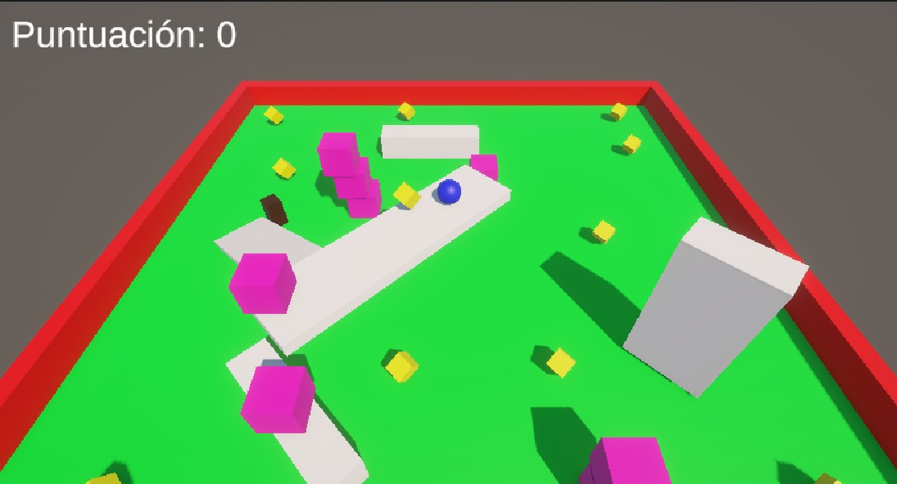
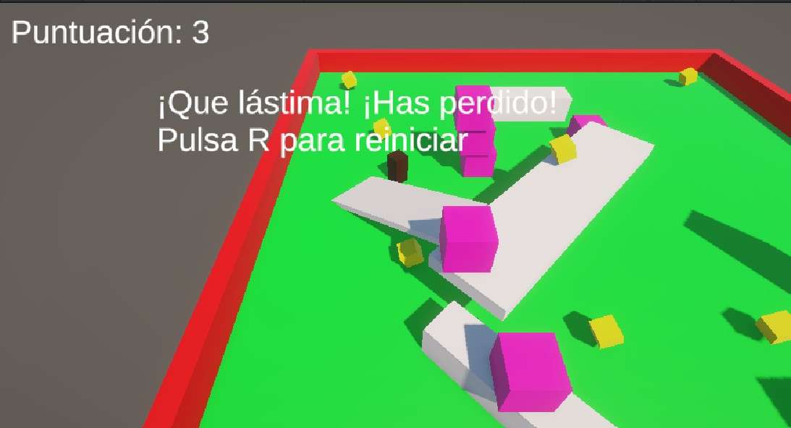
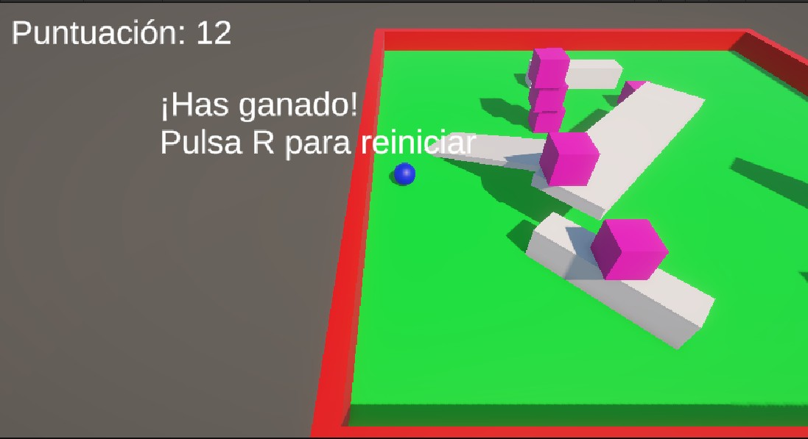

# 🎮 Roll-a-Ball (Versión Mejorada)

**Autor:** Erico Pérez Cárdenes  
**Asignatura:** PGL  
**Versión de Unity:** 6.0  
**Proyecto:** UT4_AE1_Erico  

---

## 🧠 Descripción general
Este proyecto está basado en el clásico tutorial *Roll-a-Ball* de Unity Learn.  
A partir de ese punto, he añadido varias mejoras para hacerlo más completo y divertido.  
Entre los cambios que implementé están el sistema de puntuación, la posibilidad de saltar, un enemigo con IA, y la opción de reiniciar la partida al ganar o perder.

---

## 🕹️ Controles del juego

| Acción | Tecla |
|--------|-------|
| Moverse | WASD o Flechas |
| Saltar | Barra espaciadora |
| Reiniciar partida | R |

---

## 🎯 Objetivo del juego
El jugador controla una bola que debe recoger todos los objetos **PickUp** repartidos por el escenario.  
Cada vez que recoge uno, aumenta su **puntuación**.  
Al llegar a **12 puntos**, el jugador gana la partida.  
Si el enemigo alcanza al jugador, se pierde y aparece un mensaje en pantalla con la opción de reiniciar.

---

## ⚙️ Características principales
- **Movimiento físico** usando `Rigidbody` y fuerzas aplicadas en `FixedUpdate()`.  
- **Puntuación dinámica** mostrada en pantalla con `TextMeshPro`.  
- **Sistema de salto** controlado por la barra espaciadora, con detección de suelo mediante etiquetas (`Ground`).  
- **IA enemiga** implementada con `NavMeshAgent`, que persigue al jugador durante la partida.  
- **Reinicio de partida** mediante la tecla **R**, gestionado con un script `RestartManager`.  
- **Mensajes dinámicos** de victoria o derrota con textos en español.

---

## 🧩 Estructura del proyecto
- **Assets/Scripts/**
  - `PlayerController.cs`: controla el movimiento, puntuación y colisiones.  
  - `EnemyMovement.cs`: gestiona el comportamiento del enemigo con IA.  
  - `RestartManager.cs`: permite reiniciar la partida tras ganar o perder.  
  - `CameraController.cs`: sigue al jugador durante la partida.
- **Escenas:**
  - `Level1`: escenario principal con el jugador, los pickups y el enemigo.

---

## 💡 Aspectos destacables de Unity
- Uso de **TextMeshPro** para textos más nítidos y personalizables.  
- Implementación de **NavMesh** y **NavMeshAgent** para la IA.  
- Configuración de **tags** personalizadas (`Ground`, `Enemy`, `PickUp`) para mejorar la detección de colisiones.  
- Uso del **nuevo sistema de entrada (Input System)**.  
- Control de físicas y salto en `FixedUpdate()` para una jugabilidad fluida.

---

## 🏁 Cómo jugar
1. Abre el proyecto `UT4_AE1_Erico` en Unity 6.0.  
2. Pulsa **Play**.  
3. Mueve la bola, recoge todos los pickups y evita al enemigo.  
4. Si ganas o pierdes, pulsa **R** para volver a empezar.

---

## 📸 Capturas de pantalla

---

## 📚 Créditos
Proyecto desarrollado por **Erico Pérez Cárdenes** como parte de la asignatura **PGL**.  
Basado en el curso oficial **Roll-a-Ball** de Unity Learn, con modificaciones y ampliaciones propias.
